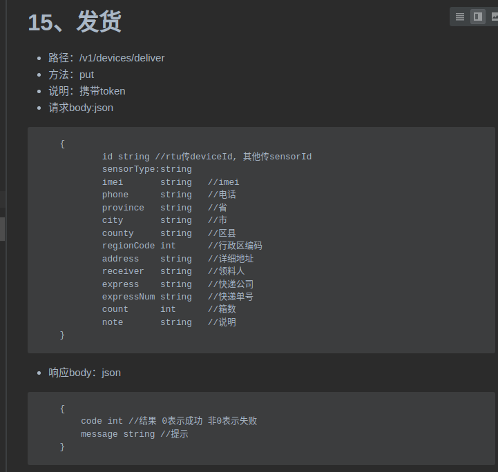
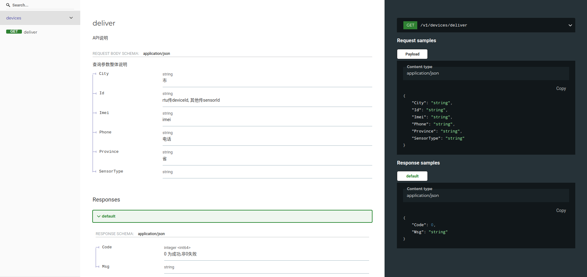
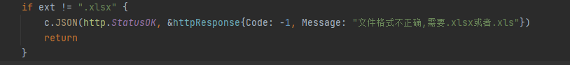

# 工程优化

## 文档优化



推荐使用 [go-swagger](https://github.com/go-swagger/go-swagger) 管理文档

使用说明：

```go

package doc

// swagger:route GET /v1/devices/deliver devices deliver
//  API说明
//     Responses:
//       default: genericResp

//swagger:parameters deliver
type DeliverReq struct {
 //查询参数整体说明
 // in:body
 Param ParamDeliver
}
//swagger:response genericResp
type GenericResp struct {
 //in: body
 Body Resp
}

--------------------------------------------------
// ParamDeliver 定义在handler文件中
type ParamDeliver struct {
 //rtu传deviceId, 其他传sensorId
 Id         string
 SensorType string
 //imei
 Imei string
 //电话
 Phone string
 //省
 Province string
 //市
 City string
}

// Resp 定义在handler 文件
type Resp struct {
 //0 为成功,非0失败
 Code int
 Msg  string
}
```



## 错误处理优化

### 推荐使用第三方错误包[errors](https://github.com/pkg/errors)

- 支持堆栈信息，更丰富的API，完全兼容官方包

### 推荐设计错误码系统

- 
- http code 200、400、500 有利于错误收集
 业务错误码 xxx-xxx-xxx 快速排除错误
 基于pkg/errors改造 添加 withCode Api

## 监控&部署

## 压力测试

## 数据拉取
